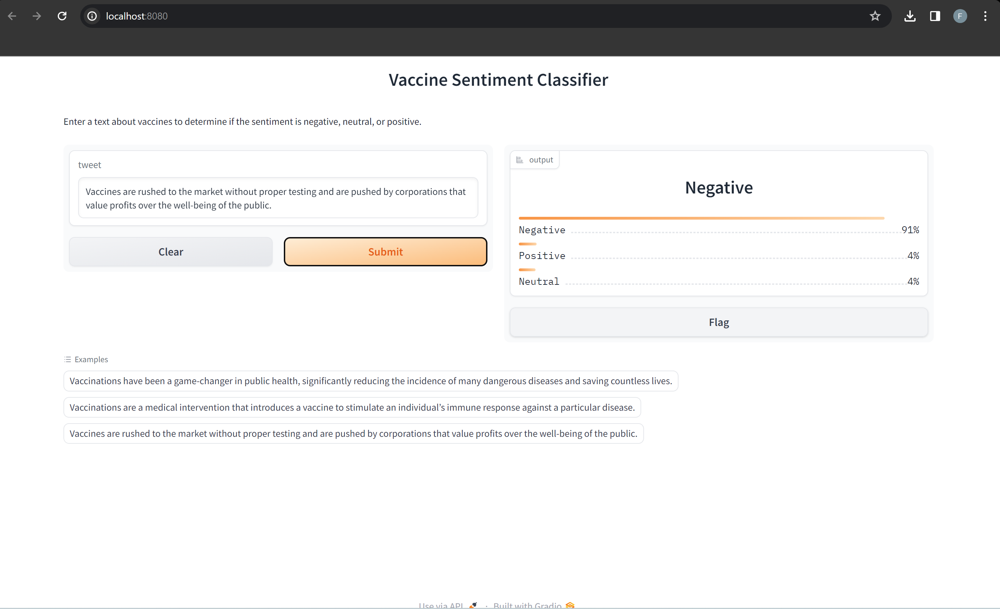

# SentimentalBERT: Vaccine Tweet Sentiment Analysis

[](LICENSE)


Fine-tuning a pre-trained transformer to classify vaccine-related tweets as
**negative, neutral or positive**, then deploying it as an interactive web app.
The goal is to better understand public opinion on social media.

- **Live app:** [Twitter Sentiment Analysis on Hugging Face Spaces](https://huggingface.co/spaces/Feiiisal/Twitter_Sentiment_Analysis_App)
- **Fine-tuned model:** [`Feiiisal/cardiffnlp_twitter_roberta_base_sentiment_latest_Nov2023`](https://huggingface.co/Feiiisal/cardiffnlp_twitter_roberta_base_sentiment_latest_Nov2023)
- **Article:** [Fine-Tuning Pre-trained Models for Robust Twitter Sentiment Analysis](https://medium.com/@feisalhassan77/insightful-analytics-fine-tuning-ai-for-robust-twitter-sentiment-analysis-8b770ffd6edb)



## What the project covers

1. **Exploratory data analysis**: sentiment distribution, tweet lengths and word
   clouds for each sentiment.
2. **Cleaning and preprocessing**: a custom tweet-cleaning function (including
   expanding contractions), and handling missing values and duplicates.
3. **Fine-tuning**: the base model is
   [`cardiffnlp/twitter-roberta-base-sentiment-latest`](https://huggingface.co/cardiffnlp/twitter-roberta-base-sentiment-latest),
   trained with class weights to handle imbalanced classes, a custom training
   class and evaluation metrics with visualisations.
4. **Model comparison**: a second notebook fine-tunes a DistilBERT model on the
   same data.
5. **Deployment**: a Gradio app, packaged with Docker and hosted on Hugging Face
   Spaces.

## Repository contents

```
Datasets/
  train_subset.csv, eval_subset.csv    Training and evaluation subsets
Dev/
  cardiffnlp_twitter_roberta_base_sentiment_latest.ipynb   Main fine-tuning notebook
  distilbert_base_uncased_finetuned_twitter_sentiment.ipynb  DistilBERT comparison
SRC/
  app.py              Gradio app (loads the fine-tuned model from the Hugging Face Hub)
  Dockerfile          Container for the app
  requirements.txt    App dependencies
Images/Screenshot.png
```

## Run the notebooks

```bash
pip install accelerate transformers torch pandas numpy datasets huggingface_hub contractions
```

The notebooks log in to the Hugging Face Hub with `notebook_login()` to push
and load models. You will be asked for your own access token; never commit it.

## Run the app

```bash
cd SRC
pip install -r requirements.txt
python app.py                     # opens on http://localhost:7860
```

With Docker (run these from the `SRC` folder):

```bash
docker build -t twitter_sentiment_analysis_app2 .
docker run -p 7860:7860 twitter_sentiment_analysis_app2
```

## Author

**Feisal Hassan**: machine learning and natural language processing.

## License

[MIT](LICENSE)
